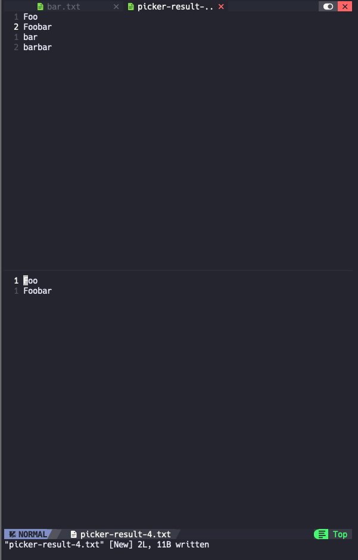

# Picker plugin

A Vim plugin, picks lines mathcing pattern into a new buffer



## Install 

Install via Lazy:
```lua
{
    url  = "git@github.com:Yusuzhan/picker-plugin.git",
    cmd="Pick",
    lazy = true,
}
```

## Usage

```
:Pick your_pattern
```
